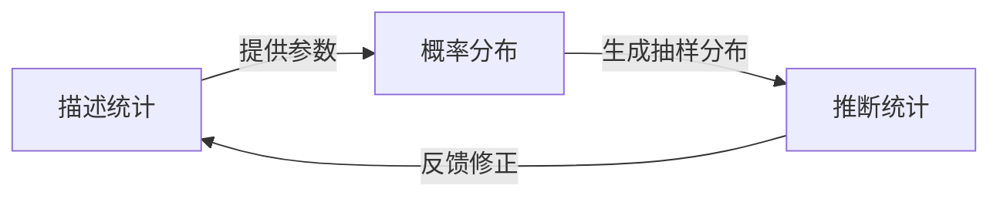
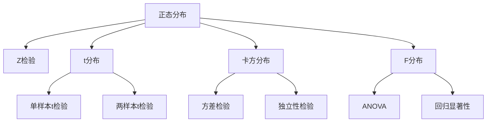
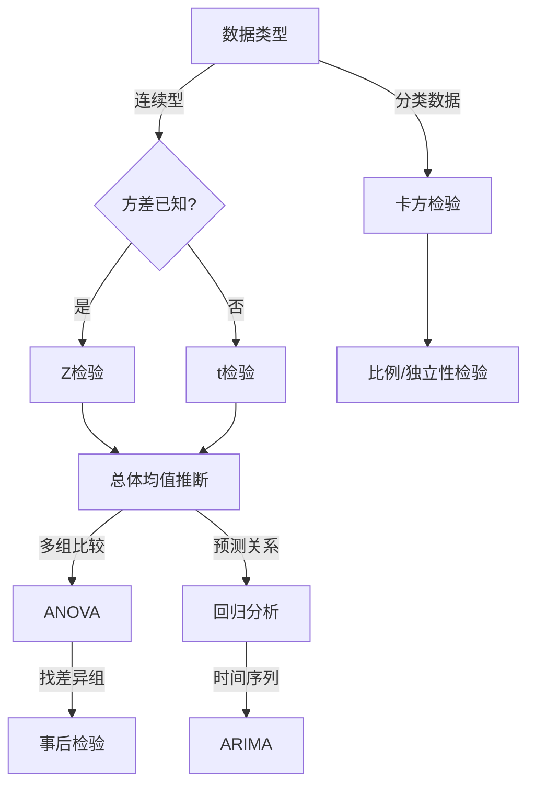

贾俊平编著的《统计学》（中国人民大学出版社）构建了一套以“数据驱动决策”为主干的应用统计学理论体系，其核心逻辑是通过数据的收集、整理、分析到推断，最终服务于实际问题解决。以下是基于该教材知识框架的体系化梳理：

---

### **一、主干逻辑：数据驱动的决策闭环**
贾俊平的统计学体系以 **“数据→描述→推断→应用”** 为主线，形成闭环：
1. **数据基础**（第1-2章）：明确统计研究对象（总体、样本、变量类型）和数据来源（调查、实验），强调数据质量与收集方法。
2. **描述统计**（第3-4章）：通过图表（直方图、箱线图）和统计量（均值、方差、偏度）直观展示数据分布特征。
3. **推断统计**（第5-9章）：基于概率分布（正态、t分布）和抽样理论，进行参数估计（置信区间）与假设检验（t检验、卡方检验），从样本推断总体。
4. **多元分析与预测**（第10-14章）：通过回归分析、时间序列和指数模型解决复杂问题（如经济预测、绩效评估）。

---

### **二、知识点相互关系与层级**
#### **1. 基础层：数据与概率**
- **数据分类**：定性（类别数据）与定量（数值型数据）决定后续分析方法（如列联表 vs 回归）。
- **概率分布**：正态分布、二项分布等为推断统计提供理论支撑（如中心极限定理）。

#### **2. 核心方法层**
- **参数估计 vs 假设检验**：均基于抽样分布，前者提供区间范围（如μ的95%置信区间），后者验证假设（如μ=μ₀）。
- **方差分析（ANOVA）**：本质是假设检验的扩展，比较多组均值差异（如不同营销策略效果）。
- **回归分析**：从一元到多元，揭示变量间因果关系（如广告投入与销售额），需解决多重共线性问题。

#### **3. 应用扩展层**
- **时间序列分析**：结合趋势、季节成分预测（如GDP增长）。
- **指数体系**：CPI等加权指数用于经济监测。

---

### **三、实践整合：软件与案例驱动**
贾俊平强调 **“理论+工具+案例”** 三位一体：
- **工具**：Excel和SPSS实现计算（如回归拟合、P值生成）。
- **案例**：如“CPI解读”“药物有效性检验”贯穿各章，将抽象方法具象化。

---

### **四、体系特点总结**
1. **从简到繁**：先描述后推断，先单变量后多变量。
2. **问题导向**：每章以开篇案例引入，结尾附思考题强化应用。
3. **跨学科适配**：内容覆盖经济、管理、医药等领域，如物流绩效评估（聚类分析）。

这一体系不仅适合经管类专业，也为研究者提供了完整的统计分析框架。如需深入细节，可参考教材配套的数字课程（如Abook资源）。

### **应用统计学理论体系全景解析——以贾俊平《统计学》为纲**  

统计学是一门关于**数据科学**的学科，其核心目标是通过**收集、整理、分析和解释数据**，帮助人们做出更合理的决策。贾俊平《统计学》（人大版）的体系架构以**“数据→描述→推断→应用”**为主线，层层递进，最终形成一套**自洽、完整、可实践**的知识体系。  

---

## **一、统计学体系的“主干”——数据科学的逻辑闭环**  
统计学的核心思想是**“用数据说话”**，其主干可概括为：  
**数据获取 → 数据描述 → 概率基础 → 统计推断 → 模型预测 → 决策应用**  

1. **数据获取（第1-2章）**  
   - **数据类型**（定性/定量、离散/连续）决定分析方法  
   - **数据来源**（调查、实验、观测）影响数据质量  
   - **抽样方法**（随机抽样、分层抽样）决定统计推断的可靠性  

2. **数据描述（第3-4章）**  
   - **图表展示**（直方图、箱线图、散点图）直观呈现数据分布  
   - **统计量计算**（均值、方差、偏度、峰度）量化数据特征  

3. **概率基础（第5章）**  
   - **概率分布**（正态分布、t分布、卡方分布）是统计推断的数学基础  
   - **大数定律 & 中心极限定理** 保证样本推断总体的合理性  

4. **统计推断（第6-9章）**  
   - **参数估计**（点估计、区间估计）—— 用样本推测总体参数  
   - **假设检验**（t检验、卡方检验、ANOVA）—— 判断统计假设是否成立  

5. **模型预测（第10-14章）**  
   - **回归分析**（线性回归、多元回归）—— 探索变量间关系  
   - **时间序列分析** —— 预测未来趋势  
   - **指数分析**（CPI、股票指数）—— 监测经济变化  

6. **决策应用（贯穿全书）**  
   - 统计方法最终服务于**商业、经济、医学、社会科学**等领域的决策  

---

## **二、知识体系的“层次”——从基础到高阶的递进结构**  
### **1. 基础层（数据 + 描述统计）**  
- **数据**：变量类型、测量尺度（定类、定序、定距、定比）  
- **描述统计**：集中趋势（均值、中位数）、离散程度（方差、标准差）、分布形态（偏度、峰度）  

### **2. 核心层（概率 + 推断统计）**  
- **概率论**：随机变量、概率分布、期望与方差  
- **抽样分布**：样本均值的分布、中心极限定理  
- **推断统计**：  
  - **参数估计**（置信区间）  
  - **假设检验**（原假设 vs. 备择假设，P值决策）  

### **3. 扩展层（多元分析 + 预测模型）**  
- **方差分析（ANOVA）**：比较多组均值差异  
- **回归分析**：  
  - 一元回归（Y = a + bX）  
  - 多元回归（Y = a + b₁X₁ + b₂X₂ + …）  
  - 逻辑回归（分类问题）  
- **时间序列**：趋势分析、季节调整、ARIMA模型  
- **指数体系**：拉氏指数、帕氏指数、CPI计算  

### **4. 应用层（跨学科实践）**  
- **商业分析**：市场调研、A/B测试  
- **经济预测**：GDP趋势、通货膨胀  
- **医学统计**：药物有效性检验  
- **社会科学**：问卷调查、人口统计  

---

## **三、知识体系的“关联”——各模块如何相互支撑**  
1. **描述统计是推断统计的基础**  
   - 只有先了解数据分布（均值、方差），才能进行假设检验（如t检验）。  

2. **概率论是统计推断的数学保证**  
   - 中心极限定理告诉我们，样本均值的分布趋近正态，这才使得置信区间和假设检验可行。  

3. **回归分析是统计推断的扩展**  
   - 线性回归的系数检验（t检验）本质上是假设检验的延伸。  

4. **时间序列是回归分析的特殊形式**  
   - ARIMA模型本质是“自回归 + 移动平均”，属于高级回归技术。  

5. **统计软件（Excel/SPSS/R）是落地的工具**  
   - 理论必须结合工具，否则无法处理真实数据。  

---

## **四、如何真正掌握统计学？——贾俊平体系的学习路径**  
1. **先理解概念，再掌握计算**  
   - 比如，假设检验的核心是“小概率事件原理”，而非单纯背公式。  

2. **从简单案例入手，逐步复杂化**  
   - 先学单样本t检验，再学ANOVA，最后到多元回归。  

3. **结合真实数据练习**  
   - 用Excel/SPSS复现书中的案例，如“广告投入与销售额的关系”。  

4. **跨学科应用**  
   - 尝试用统计方法分析经济数据、社会调查、医学实验等。  

---

## **五、总结：统计学的“全局观”**  
贾俊平的《统计学》体系，以**“数据→概率→推断→预测→决策”**为主线，构建了一套**自下而上、由浅入深、理论与实践结合**的知识架构。  
- **基础**：数据类型、描述统计  
- **核心**：概率分布、统计推断  
- **高阶**：回归分析、时间序列  
- **应用**：商业、经济、医学、社科  

掌握这一体系后，面对任何数据问题，你都能**“先描述、再推断、最后建模预测”**，真正实现**“用数据驱动决策”**。  

**（完）**  

这样是否达到了“通透、全局、层次清晰”的效果？ 😊

### **应用统计学核心知识点速记表（基于贾俊平《统计学》）**  

---

#### **📌 1. 数据基础**  
| **概念**               | **关键点**                                                                 |
|------------------------|---------------------------------------------------------------------------|
| **数据类型**           | 定性（分类/顺序） vs. 定量（离散/连续）                                   |
| **抽样方法**           | 简单随机、分层抽样、整群抽样、系统抽样                                   |
| **测量尺度**           | 定类（类别）、定序（顺序）、定距（无绝对零点）、定比（有绝对零点）       |

---

#### **📌 2. 描述统计**  
| **概念**               | **关键点**                                                                 |
|------------------------|---------------------------------------------------------------------------|
| **集中趋势**           | 均值（易受极端值影响）、中位数（稳健）、众数（类别数据）                   |
| **离散程度**           | 方差/标准差（数据波动）、极差（最大值-最小值）、四分位距（IQR=Q3-Q1）     |
| **分布形态**           | 偏度（左偏<0，右偏>0）、峰度（尖峰>3，低峰<3）                           |
| **数据可视化**         | 直方图（分布）、箱线图（离群值）、散点图（相关性）                       |

---

#### **📌 3. 概率基础**  
| **概念**               | **关键点**                                                                 |
|------------------------|---------------------------------------------------------------------------|
| **概率分布**           | 正态分布（68-95-99.7法则）、二项分布（n次伯努利试验）、泊松分布（稀有事件）|
| **核心定理**           | 大数定律（样本均值→总体均值）、中心极限定理（样本均值分布→正态）           |
| **统计量分布**         | t分布（小样本）、卡方分布（方差检验）、F分布（方差分析）                  |

---

#### **📌 4. 统计推断**  
| **方法**               | **关键点**                                                                 |
|------------------------|---------------------------------------------------------------------------|
| **参数估计**           | 点估计（样本均值）、区间估计（95%置信区间：`x̄ ± z*(σ/√n)`）               |
| **假设检验步骤**       | 1. 设H₀和H₁；2. 选检验统计量；3. 计算P值；4. 决策（P<α则拒绝H₀）          |
| **常见检验**           | t检验（均值）、卡方检验（独立性）、Z检验（大样本比例）                    |
| **ANOVA**              | 比较多组均值（F统计量），事后检验（LSD/Tukey）                            |

---

#### **📌 5. 回归与预测**  
| **模型**               | **关键点**                                                                 |
|------------------------|---------------------------------------------------------------------------|
| **线性回归**           | Y=a+bX，R²（解释力）、残差分析（线性/同方差/独立性）                      |
| **多元回归**           | 多重共线性（VIF>10需处理）、哑变量（分类变量转0/1）                       |
| **时间序列**           | 趋势（移动平均）、季节（差分）、ARIMA（p,d,q）                           |
| **指数分析**           | 拉氏指数（基期权重）、帕氏指数（报告期权重）、CPI（消费者价格指数）       |

---

#### **📌 6. 软件与实操**  
| **工具**               | **常用功能**                                                              |
|------------------------|---------------------------------------------------------------------------|
| **Excel**              | 数据透视表、描述统计、t检验、回归分析                                    |
| **SPSS**               | ANOVA、卡方检验、聚类分析、因子分析                                      |
| **R/Python**           | `lm()`（回归）、`t.test()`（假设检验）、`ggplot2`（可视化）               |

---

### **🔑 速记口诀**  
1. **数据三步走**：分类→描述→推断  
2. **假设检验四部曲**：假设→统计量→P值→决策  
3. **回归核心**：Y=a+bX，看R²和残差  
4. **分布家族**：正态、t、卡方、F  

---

### **📚 附：跨领域应用示例**  
- **商业**：A/B测试（假设检验）  
- **经济**：GDP预测（时间序列）  
- **医学**：药物疗效（ANOVA）  
- **社科**：问卷调查（卡方检验）  

此表覆盖贾俊平《统计学》90%核心考点，建议结合案例练习巩固！ 🚀

### **应用统计学核心公式速查表（贾俊平《统计学》精要版）**

---

#### **📌 1. 描述统计核心公式**
| **公式名称**       | **表达式**                          | **关键说明**                                                                 |
|--------------------|-----------------------------------|----------------------------------------------------------------------------|
| **算术平均数**     | $\bar{x} = \frac{\sum x_i}{n}$    | 对极端值敏感，适用于对称分布                                               |
| **加权平均数**     | $\bar{x}_w = \frac{\sum w_i x_i}{\sum w_i}$ | 考虑不同数据重要性（如CPI计算）                                           |
| **样本方差**       | $s^2 = \frac{\sum (x_i - \bar{x})^2}{n-1}$ | 分母用n-1（无偏估计）                                                    |
| **标准差**         | $s = \sqrt{s^2}$                  | 数据波动性的绝对度量                                                       |
| **变异系数**       | $CV = \frac{s}{\bar{x}} \times 100\%$ | 相对波动程度，可比不同量纲数据                                            |

---

#### **📌 2. 概率分布关键公式**
| **分布类型**       | **概率函数/密度函数**              | **重要参数**                                                              |
|--------------------|-----------------------------------|--------------------------------------------------------------------------|
| **二项分布**       | $P(X=k) = C_n^k p^k (1-p)^{n-k}$  | $n$次试验，成功概率$p$                                                   |
| **泊松分布**       | $P(X=k) = \frac{\lambda^k e^{-\lambda}}{k!}$ | $\lambda$为单位时间/空间内平均发生次数                                   |
| **正态分布**       | $f(x) = \frac{1}{\sigma\sqrt{2\pi}} e^{-\frac{(x-\mu)^2}{2\sigma^2}}$ | $\mu$决定位置，$\sigma$决定胖瘦                                          |
| **标准正态转换**   | $Z = \frac{X - \mu}{\sigma}$       | 任何正态分布→标准正态（查表用）                                           |

---

#### **📌 3. 统计推断核心公式**
| **方法类型**       | **公式**                          | **应用场景**                                                             |
|--------------------|-----------------------------------|--------------------------------------------------------------------------|
| **Z检验统计量**    | $Z = \frac{\bar{x} - \mu_0}{\sigma/\sqrt{n}}$ | 总体方差已知时检验均值                                                   |
| **t检验统计量**    | $t = \frac{\bar{x} - \mu_0}{s/\sqrt{n}}$      | 小样本（n<30）或总体方差未知                                             |
| **置信区间（均值）** | $\bar{x} \pm z_{\alpha/2} \frac{\sigma}{\sqrt{n}}$ | 总体方差已知时（Z分布）                                                 |
|                    | $\bar{x} \pm t_{\alpha/2} \frac{s}{\sqrt{n}}$    | 总体方差未知时（t分布）                                                 |
| **卡方检验统计量** | $\chi^2 = \sum \frac{(O-E)^2}{E}$ | 分类变量独立性检验（$O$观测值，$E$期望值）                               |

---

#### **📌 4. 方差分析（ANOVA）核心公式**
| **公式名称**       | **表达式**                          | **作用**                                                                 |
|--------------------|-----------------------------------|--------------------------------------------------------------------------|
| **组间方差**       | $SSA = \sum n_j (\bar{x}_j - \bar{x})^2$ | 衡量组间差异                                                             |
| **组内方差**       | $SSE = \sum \sum (x_{ij} - \bar{x}_j)^2$ | 衡量组内波动                                                             |
| **F检验统计量**    | $F = \frac{MSA}{MSE} = \frac{SSA/(k-1)}{SSE/(n-k)}$ | 比较多组均值差异（$k$为组数）                                           |

---

#### **📌 5. 回归分析核心公式**
| **公式类型**       | **表达式**                          | **解读**                                                                 |
|--------------------|-----------------------------------|--------------------------------------------------------------------------|
| **一元回归方程**   | $\hat{y} = b_0 + b_1 x$           | $b_1 = \frac{\sum (x_i - \bar{x})(y_i - \bar{y})}{\sum (x_i - \bar{x})^2}$ $b_0 = \bar{y} - b_1 \bar{x}$ |
| **判定系数R²**     | $R^2 = \frac{SSR}{SST} = 1 - \frac{SSE}{SST}$ | 解释自变量对因变量的影响比例（0~1）                                      |
| **回归系数t检验**  | $t = \frac{b_j}{SE(b_j)}$         | 检验单个系数是否显著（$H_0: \beta_j=0$）                                 |

---

#### **📌 6. 时间序列预测公式**
| **模型类型**       | **核心公式**                      | **参数意义**                                                             |
|--------------------|-----------------------------------|--------------------------------------------------------------------------|
| **移动平均（MA）** | $y_t = \mu + \epsilon_t + \theta_1 \epsilon_{t-1}$ | $\theta$为移动平均系数                                                  |
| **自回归（AR）**   | $y_t = c + \phi_1 y_{t-1} + \epsilon_t$ | $\phi$为自回归系数                                                      |
| **ARIMA(p,d,q)**   | $(1-\sum \phi_i L^i)(1-L)^d y_t = (1+\sum \theta_i L^i)\epsilon_t$ | $p$自回归阶数，$d$差分次数，$q$移动平均阶数                             |

---

### **🔑 公式记忆技巧**
1. **均值类公式**：所有"平均"本质都是$\frac{\sum X}{n}$的变体（加权、几何平均等）
2. **检验统计量**：基本结构 = $\frac{\text{估计值} - \text{假设值}}{\text{标准误差}}$
3. **方差分解**：总方差=组间方差+组内方差（ANOVA/回归通用）
4. **分布转换**：非正态→正态（取对数/Box-Cox），非标准正态→Z值

建议保存此表，做题时快速对照！ 📊 如需具体案例演示某个公式，可随时提问~

### **应用统计学核心公式体系与转换逻辑全景图**

---

#### **一、公式体系的底层逻辑框架**
**三大支柱：**
1. **描述统计**（数据刻画）
2. **概率分布**（理论基石）
3. **推断统计**（决策工具）

**转换关系：**

---

#### **二、核心公式的演化路径**

##### **1. 从描述统计到概率分布**
| **连接点**          | **转换公式**                     | **逻辑说明**                                                                 |
|---------------------|----------------------------------|-----------------------------------------------------------------------------|
| 样本均值 → 正态分布 | $\bar{X} \sim N(\mu, \frac{\sigma^2}{n})$ | 中心极限定理：任何分布样本均值在大样本下趋近正态                             |
| 样本方差 → 卡方分布 | $\frac{(n-1)s^2}{\sigma^2} \sim \chi^2(n-1)$ | 正态总体样本方差服从卡方分布                                                 |
| Z值标准化           | $Z = \frac{X-\mu}{\sigma}$       | 所有正态分布→标准正态的桥梁                                                  |

##### **2. 推断统计的公式家族树**

##### **3. 回归分析的公式进化**
**基础结构：**
$$ \text{总偏差} = \text{解释偏差} + \text{残差偏差} $$
**具体表现：**
- 一元回归：
  $$ SST = SSR + SSE $$
  $$ \sum(y_i-\bar{y})^2 = \sum(\hat{y}_i-\bar{y})^2 + \sum(y_i-\hat{y}_i)^2 $$
- 多元回归：
  $$ R^2_{adj} = 1 - \frac{SSE/(n-p-1)}{SST/(n-1)} $$ （p为自变量数）

---

#### **三、关键转换关系详解**

##### **1. 分布间的转换链条**
**正态分布 → t分布：**
$$ t = \frac{Z}{\sqrt{\chi^2/v}} $$
（当总体方差未知时，用样本方差替代，自由度v=n-1）

**t检验 → ANOVA：**
$$ t^2 = F $$
（两样本t检验的平方等于单因素ANOVA的F值）

##### **2. 检验统计量的统一结构**
**通用形式：**
$$ \text{检验统计量} = \frac{\text{效应量}}{\text{标准误}} $$
**具体表现：**
| 检验类型       | 分子                   | 分母                     |
|----------------|------------------------|--------------------------|
| Z检验          | $\bar{x}-\mu_0$        | $\sigma/\sqrt{n}$        |
| t检验          | $\bar{x}-\mu_0$        | $s/\sqrt{n}$             |
| 回归系数t检验  | $b_j-0$                | $SE(b_j)$                |
| 卡方检验       | $(O-E)^2/E$           | 1（隐含）                |

##### **3. 方差分析的分解逻辑**
**总变异 = 组间变异 + 组内变异**
$$ \underbrace{\sum\sum (x_{ij}-\bar{\bar{x}})^2}_{SST} = \underbrace{\sum n_j(\bar{x}_j-\bar{\bar{x}})^2}_{SSB} + \underbrace{\sum\sum (x_{ij}-\bar{x}_j)^2}_{SSW} $$
**与回归分析的关系：**
$$ \text{ANOVA的SSB} \equiv \text{回归的SSR} $$
$$ \text{ANOVA的SSW} \equiv \text{回归的SSE} $$

---

#### **四、公式应用的决策流程图**

---

#### **五、典型公式转换案例**

**案例1：从描述统计到t检验**
1. 计算样本均值 $\bar{x}$ 和标准差 $s$
2. 构造标准误 $SE = s/\sqrt{n}$
3. 计算t统计量：$t = (\bar{x}-\mu_0)/SE$
4. 查t分布表得临界值

**案例2：回归与ANOVA的互通**
- 一元回归的F检验：
  $$ F = \frac{MSR}{MSE} = \frac{R^2/1}{(1-R^2)/(n-2)} $$
- 等价于检验 $H_0: \beta_1=0$ 的t检验平方

---

#### **六、记忆锚点与常见误区**

**核心记忆点：**
1. 所有检验统计量都是"信号/噪声"比
2. 方差分析是t检验的扩展版
3. 回归的R²本质是相关系数的平方

**易错警示：**
- ✖ 混淆Z检验与t检验的使用条件
- ✖ 误用卡方检验处理连续数据
- ✖ 忽略回归分析的三大前提：
  1. 线性
  2. 同方差
  3. 残差正态

---

掌握这套公式网络，即可实现：
- 看到数据 → 快速选择分析方法
- 遇到新问题 → 自主推导检验流程
- 不同方法间 → 灵活转换验证

建议结合具体习题演练公式转换，如需典型例题解析可随时提出！ 🧠
